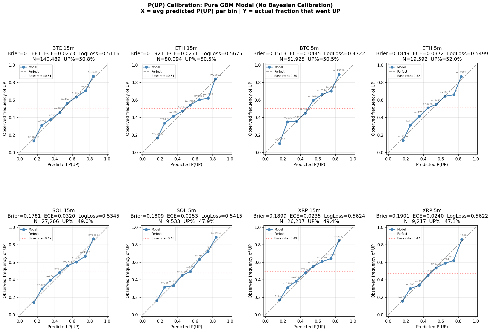
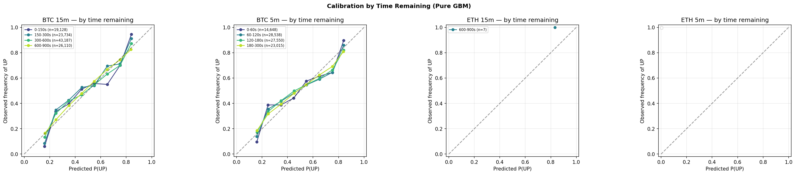
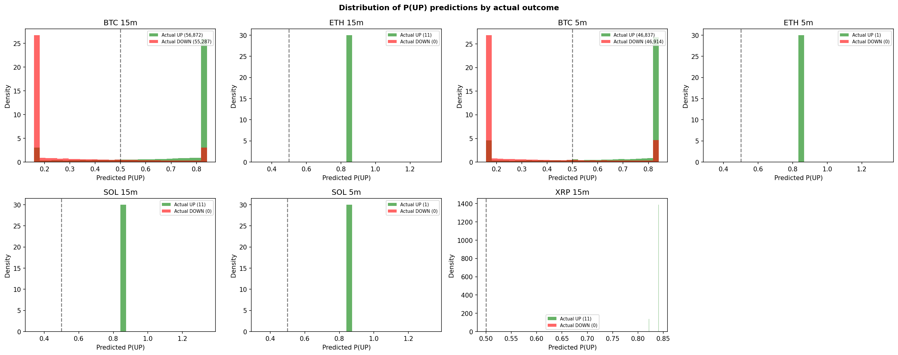

# Prediction Market Bot

Automated trading bot for Polymarket BTC / ETH / SOL / XRP "Up or Down"
binary markets (5-minute and 15-minute windows). Posts CLOB limit orders
from a diffusion-model-based signal with Bayesian calibration, market
blending, and microstructure gating.

## Quickstart

```bash
uv sync
uv run python live_trader.py --market btc --dry-run --bankroll 500
uv run python dashboard.py
uv run python backtest.py --market btc_5m --signal diffusion --train-frac 0.7
uv run python recorder.py --market btc
```

## Repo Layout

| File / Dir | Purpose |
|---|---|
| `live_trader.py` | Live-trading entrypoint. Window lifecycle, feeds, execution. |
| `backtest.py` | Walk-forward backtest engine + `DiffusionSignal` (the main signal). |
| `market_config.py` | Per-market parameters (σ bounds, thresholds, `market_blend`, gates). |
| `tracker.py` | Live state machine — orders, fills, resolutions, bankroll. |
| `feeds.py` | WebSocket feeds: CLOB book, Chainlink RTDS, Binance book ticker. |
| `recording.py` / `recorder.py` | Per-second parquet snapshot writer. |
| `orders.py` / `redemption.py` | Order placement; on-chain CTF redemption. |
| `market_api.py` | Gamma API + CLOB REST client. |
| `dashboard.py` + `dashboard_signal_worker.py` | FastAPI web dashboard. |
| `display.py` | Terminal UI for `live_trader.py`. |
| `tick_backtest.py` / `train_filtration.py` / `clean_data.py` | Support scripts. |
| `filtration_model.py` / `.pkl` | XGBoost confidence gate (opt-in). |
| `regime_classifier.py` / `.pkl` | HMM regime classifier (auto-loaded). |
| `data/` | Per-second parquet snapshots per market. Gitignored. |
| `analysis/` | Offline analysis scripts + plot outputs + notebooks. |
| `scripts/` | Validation scripts, training scripts, σ estimators, Hawkes tools. |
| `tests/` | Unit tests. |
| `validation_runs/` | Trade parquets, metrics, ergodicity plots, RESULTS docs. |
| `tasks/findings/` | Dated markdown findings from each investigation. |
| `rust/` | Experimental Rust WebSocket client. |

## Signal Pipeline

`DiffusionSignal.decide_both_sides()`:

1. Gates: missing book / invalid asks / stale feature (book, chainlink, binance, trade tape).
2. σ estimation (Yang-Zhang on 5s bars, opt-in EWMA/RV/GARCH).
3. `z = (chainlink − window_start) / (σ · √τ)`, capped.
4. `p_model = Φ(z)`.
5. Bayesian fusion with calibration table: `p = w·p_cal + (1−w)·p_model`.
6. Market blend: `p_final = (1−blend)·p + blend·mid_up`.
7. OBI nudge + reversion discount.
8. Edge = `p − bid − spread_penalty − fees`.
9. Fractional Kelly × regime multiplier.
10. Entry gates: `min_entry_z`, `min_entry_price`, `edge_threshold`, momentum, spread, toxicity.

## Shipped Params

| Market | `tail_mode` | `market_blend` | `min_entry_z` | `min_entry_price` | `max_book_age_ms` |
|---|---|---:|---:|---:|---:|
| BTC 15m (`btc`) | kou | 0.5 | 0.5 | 0.25 | – |
| BTC 5m (`btc_5m`) | kou | 0.3 | 0.0 | 0.20 | 1000 |
| ETH 15m (`eth`) | student_t (ν=13) | 0.0 | 0.5 | 0.25 | – |
| ETH 5m (`eth_5m`) | student_t (ν=15) | 0.0 | 0.5 | 0.25 | – |
| SOL / XRP 15m / 5m | normal | 0.0 | 0.5 | 0.25 | – |

## Plots




