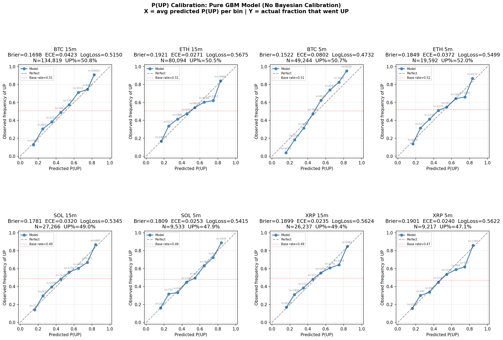
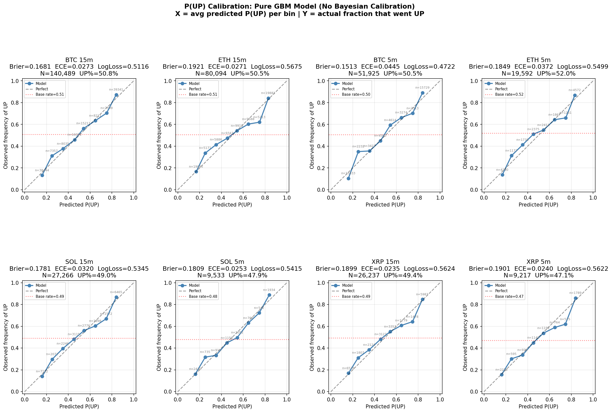
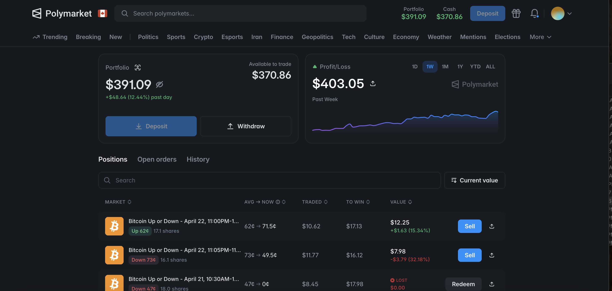

# Prediction Market Trading Systems

Two approaches I built for trading Polymarket's BTC/ETH up-down binary markets.

## Layout

- `gbm-kou/` — A Bayesian price model (Kou jump-diffusion).
- `latency-arb/` A Rust bot exploiting the lag between Binance and Polymarket.

## gbm-kou — Kou jump-diffusion model

Polymarket BTC up-down markets resolve based on the Chainlink BTC price at a fixed window end (5m or 15m). The bot models the BTC log-return process as a Kou jump-diffusion:

```
dS_t / S_t = μ dt + σ dW_t + (Y - 1) dN_t
```

with `N_t` a Poisson process and `log Y` two-sided exponential. From a fitted (μ, σ, λ, p, η₁, η₂) the bot computes `P(S_T > K)` at window expiry analytically, compares to the market mid, and takes the side where its probability beats market mid by more than fees + spread.

An XGBoost filtration model (`filtration_model.py`) gates trades by recent regime: signals during certain vol regimes were systematically wrong-way, so the filter learns to suppress them.




## latency-arb

A Rust bot that subscribes to four feeds and fires market-buys when Binance moves faster than Polymarket's resting quotes can adjust.

Feeds: Binance WebSocket (`btcusdt@bookTicker`), Coinbase WebSocket, Chainlink price oracle (HTTP), Polymarket order-book WebSocket. Measured Binance-to-Chainlink lag during normal markets:

```
binance  -> chainlink  lag p50=  521ms  p95= 1224ms  p99= 1462ms
binance  -> coinbase   lag p50=   54ms  p95=  663ms  p99=  800ms
```

That ~500ms window is the latency-arb opportunity: if Binance's velocity exceeds a threshold, the Chainlink price feed that Polymarket uses hasn't been priced in.

### Signal

Let `mid_bn(t)` be the Binance mid at time t, `Δ₂ₛ = mid_bn(t) - mid_bn(t-2s)`, and `σ₂ₛ` an EWMA of squared 2s returns with λ = 0.94

```
|Δ₂s|       > max(floor, k · σ₂s)          [k = 2.5]
sign(Δ_cb)   = sign(Δ_bn)                   [cross-venue consensus]
book_age    ∈ [600ms, 5000ms]              [Polymarket book staleness band]
ask         ∈ [0.15, 0.85]                  [avoid extremes where fee dominates]
```

Position size scales with z-score: `notional = base · clip(|z|/k, 1.0, 1.5)`.

Polymarket charges a dynamic taker fee `f(p) = 0.072 · p · (1−p)`, peaking near $0.018 per share at p = 0.5. Expected EV per fill, ignoring slippage:

```
EV = P(win) · (1 − ask) − (1 − P(win)) · ask − f(ask) · ask
```

### Results



## Why I stopped it.

Fees. Polymarket dropped the v1 CLOB API and migrated everyone to a new v2 client around late April. The dynamic fee model that came with v2 (`0.072 · p · (1−p)` charged on top of every taker fill) made any sub-2% per-trade edge unprofitable in practice.

Competition. We're on EC2 Dublin with sub-millisecond RTT to Polymarket's edge. Yet, the competition reaches first every single time.

Adverse selection. On the strongest signals, the makers update their quotes before us and we only fill in on trades we shouldn't take.

Price manipulation. At low-volume hours such as (12:00–16:00 UTC), it's hard to prove but the data hinted that some samples deviated from their expected behaviour.
