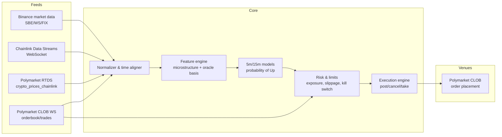
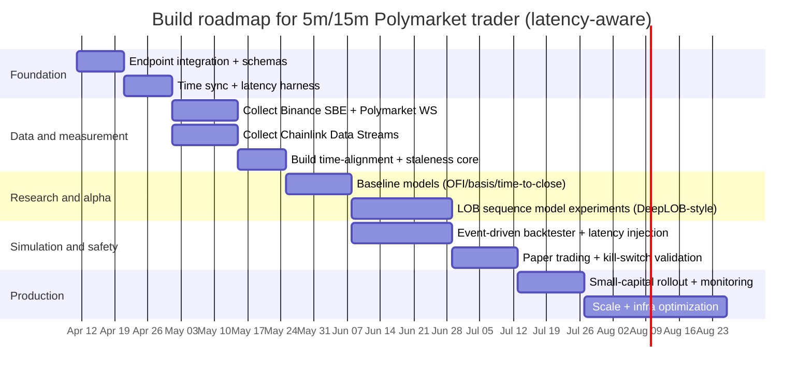

# Latency Arbitrage Design for Automated 5‑Minute and 15‑Minute Trading on Polymarket Using Chainlink Data Streams and Binance Feeds

## Executive summary

Polymarket’s 5‑minute and 15‑minute “Up or Down” crypto markets resolve against the **Chainlink BTC/USD (and related) data stream**, not against any single exchange’s spot price. On Polymarket’s own market pages, the rules explicitly state that resolution is determined by comparing the Chainlink data stream’s price at the start vs. the end of the specified window, and they caution that “live data may be delayed by a few seconds.” citeturn9view0turn18search0 This creates two distinct opportunities (and risks) for an automated trader:

First, a **data‑timing / feed‑selection edge** arises if competitors rely on delayed UI displays or indirect proxies, while you subscribe directly to low‑latency sources (Chainlink Data Streams WebSocket, Polymarket RTDS, Polymarket CLOB WebSocket, and/or Binance SBE/FIX). Chainlink Data Streams is explicitly architected for “sub‑second data latency through WebSocket subscriptions,” using an offchain DON and an aggregation network. citeturn6view0

Second, a **microstructure forecasting edge** may exist on 5‑minute and 15‑minute horizons by predicting the probability that the Chainlink stream’s end‑timestamp price will be above the start‑timestamp price, using high‑frequency features (order flow imbalance, trade imbalance, short‑horizon volatility regime, basis vs. Chainlink). The academic microstructure literature supports the usefulness of order‑flow imbalance and order‑book signals over short intervals, and deep models trained on LOB sequences can extract predictive patterns from multi‑level books. citeturn21search8turn21search1

The core engineering challenge is not “one latency number” but **measurable end‑to‑end timing**: (a) publication cadence and timestamps at each data source, (b) network transport time into your system, (c) decision latency (feature compute + model inference), and (d) execution latency through Polymarket’s hybrid CLOB (offchain match, onchain settlement on entity["organization","Polygon","evm chain network"]). Polymarket documents that orders are created offchain, matched by an operator, and settled onchain, and that trading uses EIP‑712 signed messages with atomically settled trades on Polygon. citeturn7view0turn14search2

A compliant, defensible build should prioritize: direct ingestion of the **exact resolution source** (Chainlink Data Streams), rigorous latency instrumentation with synchronized clocks (Chainlink API authentication itself requires timestamps close to server time), conservative execution/risk controls, and explicit legal/compliance review—especially given that Polymarket operates “globally through separate legal entities,” while Polymarket US is operated by entity["company","QCX LLC","d/b/a Polymarket US"] as a designated contract market under the entity["organization","Commodity Futures Trading Commission","us derivatives regulator"]. citeturn10search0turn10search3turn9view0

## Data sources and feed mechanics

Polymarket’s crypto short‑interval markets, Chainlink Data Streams, and Binance market data each have different *timing semantics* (cadence, timestamps, and propagation). Treat them as separate clocks and reconcile them explicitly.

Polymarket publishes market data through multiple surfaces: public REST APIs (Gamma/Data/CLOB), WebSocket channels for near real‑time market microstructure, and a separate Real‑Time Data Socket (RTDS) that carries “crypto_prices” from Binance and Chainlink sources. citeturn7view1turn20view0turn3view0 Polymarket’s trading system is hybrid‑decentralized: offchain matching + onchain settlement via an exchange contract on Polygon, with EIP‑712 signed orders. citeturn7view0

Chainlink Data Streams, separately, is designed to deliver **low‑latency market data offchain** with optional onchain verification. Its architecture is pull‑based and uses (i) a DON that reaches consensus and signs reports and (ii) an aggregation network that provides those signed reports by API (REST or WebSocket), with “sub‑second data latency through WebSocket subscriptions.” citeturn6view0turn11search6

Binance is your assumed “own market feed.” For market data, Binance supports JSON WebSocket streams (with documented update speeds up to 100ms for certain depth streams), higher‑performance SBE market‑data streams (documented 50ms update speed for depth and depth snapshots), and FIX market‑data sessions for institutional connectivity. citeturn5view3turn17view2turn17view0

image_group{"layout":"carousel","aspect_ratio":"16:9","query":["Polymarket 5 minute crypto markets screenshot","Chainlink Data Streams architecture diagram","Binance SBE Market Data Streams documentation screenshot"],"num_per_query":1}

### Comparative table of endpoints, cadences, and practical pros/cons

| Source | What it provides | Access surface (endpoint / method) | Cadence / update rate (documented) | Timestamping you can measure | Auth & cost | Latency‑arb pros / cons |
|---|---|---|---|---|---|---|
| Polymarket RTDS (Chainlink crypto prices) | Streamed prices by symbol (e.g., `btc/usd`) | `wss://ws-live-data.polymarket.com` with topic `crypto_prices_chainlink` citeturn2view0turn3view1 | Not explicitly specified for crypto; RTDS equity streams note sub‑second updates “up to 5 per second per feed” during market hours citeturn19view0 | RTDS messages include `payload.timestamp` (“when the price was recorded”) and top‑level timestamps; equity payloads include `received_at` citeturn19view0turn2view0 | Docs state crypto prices are “No authentication required,” but Chainlink key sponsorship is referenced for Chainlink subscription citeturn19view0turn3view1 | **Pro:** simple subscription; aligns with Polymarket’s own Chainlink stream surface. **Con:** may be a proxy vs. direct Chainlink Data Streams; might inherit delays noted on market pages (“delayed by a few seconds”). citeturn9view0turn18search0 |
| Polymarket RTDS (Binance crypto prices) | Streamed Binance‑sourced prices by symbol (e.g., `btcusdt`) | Same RTDS endpoint; topic `crypto_prices_binance` citeturn3view1turn19view0 | Not explicitly specified | RTDS payload includes `timestamp` (“when price was recorded”) citeturn19view0turn2view0 | No auth stated for crypto citeturn3view0turn11search15 | **Pro:** easy. **Con:** for trading *resolution*, Binance price is not the oracle—markets warn resolution is per Chainlink data stream, “not … spot markets.” citeturn9view0turn18search0 |
| Polymarket CLOB WebSocket (market channel) | Real‑time orderbook snapshots, price changes, last trade price, and best_bid_ask | `wss://ws-subscriptions-clob.polymarket.com/ws/market` citeturn20view1turn20view0 | “Near real‑time” (not quantified) citeturn20view0 | Messages contain `timestamp` fields; event types include `book`, `price_change`, `best_bid_ask`, etc. citeturn20view1turn20view0 | No auth for market channel citeturn20view0 | **Pro:** essential for execution‑quality (microprice, spread, queue). **Con:** not the oracle feed; also subject to your own processing and subscription fan‑out. |
| Polymarket CLOB REST | Snapshots, prices, historical series | `https://clob.polymarket.com` market data endpoints (e.g., `/book`, `/price`, `/prices-history`) citeturn7view2turn7view1 | Request/response | Server time endpoint exists; REST is slower than WS and rate‑limited | Public market‑data endpoints need no auth; trading endpoints need auth citeturn7view1turn7view0 | **Pro:** good for backfill and validation. **Con:** unsuitable for latency‑critical decisions vs WS. |
| Chainlink Data Streams (direct) | Signed oracle reports with observation timestamps | REST mainnet: `https://api.dataengine.chain.link`; WebSocket via SDK (example testnet shows `wss://.../ws`) citeturn11search1turn11search3turn6view0 | “Sub‑second … through WebSocket subscriptions” citeturn6view0 | Reports include timestamps (e.g., observations timestamp / validity) via Data Streams APIs citeturn11search1turn6view0 | Requires API key + HMAC headers; billing is subscription‑based citeturn11search2turn12view0 | **Pro:** closest to the resolution source; engineered for low latency. **Con:** commercial subscription + integration complexity; must verify symbol/feed IDs match resolution stream. |
| Binance JSON WebSocket streams | Trades, best bid/ask, depth diffs, klines | `wss://stream.binance.com:9443` (typical) plus stream names like `<symbol>@trade`, `<symbol>@depth@100ms` citeturn5view1turn16search3 | Trades: “Real‑time”; bookTicker: “Real‑time”; depth streams: 1000ms or 100ms citeturn5view1turn5view6turn5view3 | Event time fields (ms) allow measurable arrival‑minus‑event time citeturn5view1 | Public citeturn5view1 | **Pro:** good baseline feed; simpler than SBE/FIX. **Con:** JSON decode overhead and slower depth cadence vs SBE (50ms). citeturn17view2 |
| Binance SBE market‑data streams | Binary trades, best bid/ask, depth diffs, snapshots | Base: `stream-sbe.binance.com`; WS endpoints, API key required citeturn17view2 | Depth diff and depth20 snapshots: 50ms; trades: “Real time” citeturn17view2 | “All time and timestamp fields are in microseconds” citeturn17view2turn17view1 | API key needed; Ed25519 keys allowed; public market data needs no extra perms citeturn17view2turn17view0 | **Pro:** best public Binance cadence; microsecond timestamps. **Con:** integration effort + operational limits (24h connections, ping/pong). citeturn17view2 |
| Binance FIX market‑data sessions | Market data + instruments queries over FIX | `tcp+tls://fix-md.binance.com:9000` (and SBE variants) citeturn17view0 | Session‑based; depends on subscriptions | FIX timestamps, plus your arrival timestamp | API key permissions required; institutional setup citeturn17view0 | **Pro:** institutional channel; potentially more stable/performant for some use cases. **Con:** operational overhead (TLS, keys, sessions) and not necessarily “faster than SBE WS” without proximity. |

## End‑to‑end latency surfaces and measurement methodology

Latency arbitrage only exists if you can **measure and control** the timing gap between what you know and what other market participants can act on. In this problem, there are four interacting clocks:

1. **Binance matching engine / feed timestamp** (trade time, event time, microsecond timestamps in SBE). citeturn5view1turn17view2  
2. **Chainlink Data Streams report timestamps** (when the DON observed and signed a report; served via the aggregation network). citeturn6view0turn11search1  
3. **Polymarket market microstructure timestamps** (CLOB WS event timestamps; plus RTDS “price recorded” timestamps). citeturn20view1turn19view0  
4. Your **local measurement time** (monotonic clock for durations, wall clock for cross‑system alignment).

A robust methodology is to treat every incoming message as an event with three timestamps:
- `t_source` = the timestamp embedded in the message (Binance `E`/`T`, RTDS `payload.timestamp`, Chainlink report timestamp). citeturn5view1turn19view0turn11search1  
- `t_arrival` = when your NIC/kernel/userspace receives the bytes (preferably captured as early as possible).  
- `t_decision` = when your strategy produces an order instruction.  
You then measure and log:
- **Transport latency estimate:** `t_arrival - t_source` (after normalizing units and timebases).  
- **Processing latency:** `t_decision - t_arrival`.  
- **Execution latency:** from order submission to order acknowledgment / fill event.

### Observable “typical” and “best‑case” latencies you can actually quantify

Some components have explicit latency/cadence statements you can anchor on:

- **Binance update speeds (best‑case data cadence):**  
  - Spot depth streams can be as fast as **100ms** (JSON) citeturn5view3 and **50ms** (SBE). citeturn17view2  
  - Trades and best bid/ask are documented as “Real‑time” streams. citeturn5view1turn17view2  
  These are best‑case publication cadences; your observed end‑to‑end will include path latency and batching.

- **Chainlink Data Streams (best‑case data cadence):**  
  Documentation explicitly claims “sub‑second data latency through WebSocket subscriptions.” citeturn6view0  
  The architecture also supports multi‑site active‑active deployment and even suggests concurrent multi‑origin WebSocket subscriptions for resilience and low latency. citeturn6view0

- **Polymarket market‑page “typical” display delay risk:**  
  For 5‑minute and 15‑minute crypto markets, Polymarket pages warn: “Live data may be delayed by a few seconds.” citeturn18search0turn9view0  
  You should treat that as an explicit statement that some user‑visible or consumer surfaces may lag.

- **Onchain settlement/finality constraint:**  
  Even if offchain matching is fast, onchain settlement inherits chain finality properties. Polygon documentation describes deterministic finality “between 2‑5 seconds” after Heimdall v2, with 1–2 second block time. citeturn15search15  
  Polygon has also had real incidents where finality was delayed materially (10–15 minutes). citeturn15search8turn15search2  
  A trading/settlement pipeline must degrade safely under such regimes.

### Practical latency measurement implementation

A workable approach (used by most low‑latency desks in some form) is to run a “latency harness” alongside your strategy:

- **Ingress capture:** log raw messages with high‑resolution timestamps at receipt. For Binance SBE, timestamps are in microseconds, which is helpful for fine‑grained latency histograms. citeturn17view2turn17view1  
- **Clock discipline:** for any authenticated oracle feed that uses timestamps in auth headers, ensure tight time sync. Chainlink’s Data Streams auth headers require a timestamp “with precision up to milliseconds,” and the server time discrepancy tolerance is described as 5 seconds by default. citeturn11search1turn11search2  
- **Cross‑source alignment tests:** periodically compute (a) Binance mid vs Chainlink stream value vs Polymarket displayed price, and (b) time‑skew between each stream’s embedded timestamps and your arrival time. (This is analysis, but it should be done continuously.)

A minimal set of latency metrics you should publish per symbol/market:
- `p50/p95/p99` of `arrival_minus_source_timestamp` for each feed (Binance SBE, Chainlink direct, RTDS).  
- “Decision time” (feature + inference) distribution.  
- Polymarket “order‑to‑ack” and “order‑to‑match/confirm” (user channel provides trade lifecycle updates, e.g., MATCHED → CONFIRMED). citeturn20view0  

## Information edge strategies and infrastructure requirements

There are only a few legitimate ways to be “earlier” in an electronic market, and they correspond directly to measurable bottlenecks: eliminate slow intermediaries, shorten physical distance, reduce system jitter, and reduce uncertainty in transaction propagation.

### Where “early” information can come from in this specific setup

**Direct oracle feed vs platform proxy.**  
Polymarket’s rules specify the resolution source is the Chainlink data stream (e.g., BTC/USD) and explicitly warn that live data may lag by seconds. citeturn18search0turn9view0  
Therefore, a structurally strong position is to consume **Chainlink Data Streams directly** (WebSocket, sub‑second) rather than relying on a UI‑oriented surface. citeturn6view0turn11search0

**High‑cadence exchange feed vs lower‑cadence feed.**  
If your modeling uses Binance as a leading indicator, you should pick the highest‑fidelity Binance market‑data surface you can reliably run. Binance documents 50ms update speed for SBE depth diff and depth snapshots, with microsecond timestamps. citeturn17view2turn17view1  
This is a meaningful difference vs 100ms JSON depth streams. citeturn5view3

**Orderbook awareness inside Polymarket.**  
Latency arbitrage is not only about knowing price direction; it is also about knowing whether you can *get filled profitably*. Polymarket’s market channel streams orderbook and trade events in real time (book snapshots, price changes, best bid/ask). citeturn20view1turn20view0  
Any serious bot needs this feed to price slippage, queue risk, and whether to post or take.

### Network topology, colocated nodes, and RPC considerations

Because Polymarket trading settles on Polygon, and because both Chainlink and Binance feeds are network‑delivered, your effective latency is a sum of:
- WAN latency to Chainlink Data Streams aggregation endpoints (which are deployed in multiple origins behind a load balancer; Chainlink describes active‑active multi‑site deployment and even publishing origins so customers can target specific sites). citeturn6view0  
- WAN latency to Binance endpoints (you choose REST vs JSON WS vs SBE WS vs FIX). citeturn17view2turn5view1turn17view0  
- WAN latency to Polymarket CLOB endpoints (market WS, trading REST). citeturn20view0turn7view0  
- Blockchain RPC latency if/when you perform onchain actions (including cancellations or settlements under certain flows). Polymarket notes users can always cancel orders onchain independently, which implies onchain interactions matter in some states. citeturn7view0

In practice, the “earliest” competitors will often run:
- **Multi‑region strategy pods** (e.g., one close to Binance infrastructure, one close to Polymarket/CLOB, one close to Chainlink Data Streams origins), with deterministic replication and a “best‑timestamp wins” merger for oracle/event ticks (this is a recommended design pattern given Chainlink’s explicit multi‑origin guidance). citeturn6view0  
- **Dedicated RPC providers or self‑hosted nodes** for Polygon to reduce state‑read latency and transaction submission jitter. Polygon’s own description of fast finality (2–5 seconds) makes it feasible to incorporate onchain confirmations into near‑real‑time monitoring, but past incidents show you must fail safe under degraded finality. citeturn15search15turn15search8  

### Mempool monitoring and private relays

Your request includes mempool monitoring and private relays. This is an area where **capabilities exist**, but **usage must be carefully constrained by law, exchange rules, and market integrity considerations**.

From a purely technical standpoint:
- Private transaction submission systems exist (commonly associated with MEV mitigation). For example, entity["company","Flashbots","mev research org"] documents private transaction submission methods such as `eth_sendPrivateTransaction`. citeturn22search0turn22search20  
- Third‑party infrastructure advertises low‑latency transaction/mempool data across multiple chains including Polygon (e.g., mempool streams). citeturn22search33  
- Ethereum documentation discusses MEV and private communication channels designed to reduce frontrunning risk. citeturn22search14  

For a Polymarket trading system, the strongest *legitimate* use cases are:
- **Defense:** reduce the chance your own onchain cancellations/settlements are copied or sandwiched in public mempools (where applicable). citeturn22search14turn22search0  
- **Reliability monitoring:** detect propagation problems, delayed inclusion, or RPC issues early—especially important given Polygon’s history of finality incidents. citeturn15search8turn22search25  

### Required infrastructure checklist

A practical infrastructure target for a serious 5m/15m automated trader includes:

- **Compute:** dedicated bare‑metal or tuned VMs with CPU pinning and predictable NIC behavior; separate ingestion, feature/model, and execution processes to isolate jitter (design recommendation).
- **Time synchronization:** NTP/PTP discipline plus monitoring; additionally, Chainlink Data Streams authentication imposes explicit server‑time proximity requirements (≤5 seconds by default tolerance). citeturn11search1turn11search2  
- **Network providers:** redundant ISPs, BGP‑diverse paths, and continuous RTT/loss probing to each critical endpoint (design recommendation).
- **Packet capture / observability:** raw message logs, latency histograms, per‑stage tracing, alerting on p99 spikes (design recommendation).
- **Secret handling:** secure storage for Binance API keys (required for SBE and FIX) and Chainlink Data Streams credentials. citeturn17view2turn11search2turn17view0  

## Execution architecture on Polymarket and optional external hedging

The core execution constraints are dictated by Polymarket’s market design and order types, and by the fact that the oracle (Chainlink stream) is the settlement reference.

Polymarket documents that its CLOB is a hybrid system: **offchain order matching** with **onchain settlement**; trades settle atomically on Polygon; orders are EIP‑712 signed messages. citeturn7view0turn14search2 This creates a “two‑latency” reality: the *match* can be very fast, while *finality* is bounded by chain properties and any relayer pathways.

Polymarket supports common order behaviors via four order types:
- GTC / GTD (resting limit orders)  
- FOK / FAK (market‑style orders that execute immediately against resting liquidity) citeturn14search0turn14search1turn14search3  
Polymarket also supports “post‑only” behavior for GTC/GTD (reject orders that would cross the spread). citeturn14search0turn14search5

### Execution goals by strategy class

A 5m/15m trader needs to decide whether it is primarily:
- **A taker (alpha capture):** act quickly when the model probability shifts, accepting fees/spread. This is appropriate when your signal half‑life is very short, and when you have high confidence the mispricing will close before you lose the move. (Design recommendation; cost/fee modeling required.)
- **A maker (liquidity + information advantage):** systematically post quotes (possibly post‑only) that are favorable **given your faster estimate** of “Up probability,” and capture spread / rebates where available. Polymarket has maker rebates programs and has expanded fee structures; the changelog shows 5‑minute crypto markets launched with taker fees and maker rebates similar to 15‑minute markets. citeturn13view0  

Because short‑interval markets are essentially “digital options” on a short‑horizon price move, adverse selection risk is concentrated near the end of the window: if you quote too tightly when the outcome becomes near‑certain, you get picked off.

### Recommended architecture (event‑driven, latency‑aware)

A practical execution architecture is an event‑driven system that treats each market window as its own “micro‑instrument” with a finite lifetime:

citeturn17view2turn6view0turn3view1turn20view0

Key design points:
- **Time alignment is first‑class.** Without it, you will mis‑estimate your true edge and mis‑simulate fills (design recommendation).
- **All trading decisions should key off the resolution reference.** Polymarket’s own rules emphasize the Chainlink stream governs the outcome, not spot markets. citeturn9view0turn18search0  
- **Prefer WebSockets for microstructure.** Polymarket explicitly provides a WS market channel for real‑time orderbook and trade data; RTDS provides separate crypto price streams. citeturn20view0turn3view0  

### Order‑type guidance and batching

For short‑horizon instruments, order‑type selection is a risk control:

- **To avoid immediate adverse selection and ensure maker behavior**, use post‑only GTC/GTD and enforce internal “no‑cross” checks; Polymarket states post‑only orders are rejected if they would match immediately. citeturn14search0  
- **To guarantee immediate participation**, use FOK/FAK market‑style orders; Polymarket describes FOK/FAK as market order types executing immediately against resting liquidity. citeturn14search0turn14search1  
- **Batching:** Polymarket supports posting multiple orders in a single request (documented in API reference and changelog evolution); batching is primarily useful when you need to update multiple token markets quickly and want to reduce request overhead. citeturn7view1turn13view0

### “Front‑running techniques” in scope: focus on defense and market integrity

Your prompt explicitly asks for front‑running techniques. In a professional/regulated context, the practical and defensible approach is to:  
- model the environment as adversarial (others will try to pick off stale quotes),  
- focus on *preventing yourself from being picked off*, rather than on manipulative conduct.

Technically, systems like Chainlink’s “Streams Trade” design explicitly emphasize “frontrunning mitigation” for onchain execution by executing transactions in response to verified reports and revealing data atomically onchain. citeturn6view0  
Separate ecosystems (e.g., Flashbots Protect) describe private transaction submission to reduce public‑mempool exposure. citeturn22search0turn22search14  

For a Polymarket bot, defensible controls include:
- **Short quote lifetimes** near window end  
- **State‑based quoting:** only quote when your oracle‑basis uncertainty is low  
- **Cancel‑on‑latency‑spike:** widen spreads or stop quoting when your measured p99 ingest latency deteriorates (design recommendation)  
- **Hard position limits** per window and per underlying symbol (design recommendation)

## Predictive signals and models for 5m and 15m horizons

The target variable in 5‑minute/15‑minute “Up or Down” markets is essentially:

\[
\text{Up} = \mathbb{1}\{ P_{\text{CL}}(t_{\text{end}}) \ge P_{\text{CL}}(t_{\text{start}})\}
\]

where \(P_{\text{CL}}\) is the Chainlink data stream price, and the market explicitly warns this is **not** the same as any single spot exchange. citeturn18search0turn9view0

A good modeling approach is therefore hierarchical:
1. **Nowcast the Chainlink stream price** (or its likely next report), using direct stream reports + basis features.  
2. **Forecast the distribution of end‑of‑window price relative to start**, using microstructure momentum/mean‑reversion indicators.

### Features that are empirically grounded for short horizons

**Order‑flow imbalance and best‑level pressure.**  
Cont et al. show that over short time intervals, price changes are mainly driven by **order flow imbalance** at best bid/ask, with a linear relationship whose slope depends on depth. citeturn21search8  
In crypto, a practical feature set includes:
- Best‑level imbalance \((q_{bid}-q_{ask})/(q_{bid}+q_{ask})\) over multiple horizons (e.g., 0.5s/2s/10s)  
- OFI‑style signed changes in best bid/ask depth per event  
- Microprice and “queue‑weighted mid” (design recommendation)

**Deep limit order book sequence modeling.**  
DeepLOB demonstrates that deep neural architectures combining convolutional and recurrent elements can predict short‑horizon price movement from LOB sequences, extracting robust features. citeturn21search1turn21search13  
A practical application is to train models on Binance SBE depth snapshots/diffs (50ms cadence) and predict a calibrated “Up probability” for the remainder of the 5‑minute/15‑minute window. citeturn17view2turn5view3

**Trade flow and aggressor imbalance.**  
Binance trade streams provide per‑trade events in real time. citeturn5view1turn17view2  
Useful derived signals:
- Taker buy vs sell volume imbalance over rolling windows  
- Short‑horizon realized volatility and “volatility of volatility”  
- VWAP drift vs start‑of‑window “price to beat” (as a state variable)

**Oracle‑specific features (Chainlink report patterns and basis).**  
Chainlink Data Streams reports include explicit timestamps (e.g., “observationsTimestamp”) in the API responses. citeturn11search1turn6view0  
Given Polymarket’s warning that displayed/live data can be delayed by seconds, an important feature is:
- **Basis:** \(P_{\text{Binance}} - P_{\text{Chainlink}}\) (or normalized), plus its mean/variance over recent intervals. citeturn9view0turn6view0  
- **Staleness:** current time minus last Chainlink report observation time (design recommendation).

### Model families that tend to work well operationally

For production on a high‑speed instrument set, a staged approach is often best:

- **Baseline (fast, interpretable):** logistic regression or gradient‑boosted trees for probability of “Up,” using OFI, momentum, realized vol, basis, and time‑to‑close as features (design recommendation, grounded in OFI literature). citeturn21search8  
- **Sequence model (higher ceiling):** LOB sequence model à la DeepLOB for 0.5s–10s dynamics, feeding into a higher‑level probability model for the remaining time to close. citeturn21search1  
- **Regime model:** classify whether the market is trending vs mean‑reverting (volatility regime) and flip between market‑making vs taking behavior (design recommendation).

### Using Binance as the “own feed” without confusing it with the settlement source

Because Polymarket’s rules explicitly define settlement by the Chainlink stream (and caution it can be influenced by broad conditions and other exchanges), you should treat Binance not as “truth” but as:
- a liquidity‑rich leading indicator for short‑term moves, and  
- a microstructure sensor for real‑time risk (spikes, dislocations). citeturn9view0turn18search0  

Where feasible, ingest the Chainlink stream directly (Data Streams WebSocket) and re‑express your target in terms of that feed, not Binance. citeturn6view0turn11search0

## Backtesting and simulation framework

A backtest for latency arbitrage must simulate *time*, *market impact*, and *queueing*—not just compute a signal on OHLC candles.

### Data collection required for a credible backtest

At minimum, you need an event store containing:
- **Binance:** trades + depth diffs/snapshots (prefer SBE 50ms where possible). citeturn17view2turn5view1  
- **Chainlink:** the same stream as Polymarket uses for resolution (BTC/USD etc). Polymarket’s rules point to the Chainlink “streams” pages; Chainlink Data Streams REST API supports retrieving the latest report, a report at a timestamp, and pages of sequential reports. citeturn9view0turn11search1  
- **Polymarket:** CLOB WebSocket orderbook events and trades, plus your own executed orders and acknowledgments. citeturn20view1turn7view0  

You should store every raw message with:
- embedded source timestamp(s),
- local receipt timestamp,
- local processing/inference timestamp,
- local order submission timestamp and resulting ack/fill events.

### Simulation design choices

**Event‑driven replay.**  
Reconstruct a local Polymarket orderbook using `book` snapshots and `price_change` events, in the same cadence they arrive in real time. citeturn20view1

**Latency injection.**  
Sample your measured latency distributions per feed and per action:
- feed arrival delays (p50/p95/p99),
- decision time,
- order submission/ack times.

Then replay strategies under:
- best case (p50),
- stressed case (p95/p99),
- “degraded finality” scenario (Polygon incident model). citeturn15search8turn15search2  

**Fill model.**  
At minimum:
- Taker fills at best ask/bid available at simulated time.
- Maker fills depend on queue position; approximate using time‑priority and observed trades crossing your price level (design recommendation).  

### Backtest outputs that matter for decision making

Because 5m/15m markets are short‑duration, key outputs include:
- Edge decomposition: raw model edge vs fees vs spread vs slippage.
- PnL distribution per window (not just mean).
- Sensitivity to delays (how much alpha disappears at +50ms, +250ms, +2s).
- Tail risk under oracle/platform dislocations (including “live data delayed by a few seconds” regimes). citeturn18search0turn9view0  

## Legal, ethical, and compliance risks plus prioritized roadmap and primary sources

### Legal and compliance considerations

Polymarket explicitly states it operates through separate legal entities, including a US entity operated by QCX LLC d/b/a Polymarket US that is a designated contract market under the CFTC, while the international platform “is not regulated by the CFTC and operates independently.” citeturn9view0turn10search0turn10search3 That separation matters for:
- **User eligibility (geo/identity restrictions)** and market access rules (you need counsel to interpret where you may trade).
- **Market manipulation / integrity expectations**, which are generally stricter in regulated venues but are relevant everywhere (design recommendation: treat as high risk).

Your prompt requests “front‑running techniques.” Many forms of front‑running, market manipulation, or abusive latency exploitation can violate venue rules and/or law, particularly in regulated derivatives contexts. The technically safest posture is:
- focus on **defensive execution** (avoid being picked off; avoid leaking onchain intents where applicable),
- document your strategy controls,
- avoid conduct intended to disadvantage other participants through deception or manipulation (policy recommendation).

### Ethical considerations

Even if a strategy is technically feasible, “exploit” framing matters. A strong ethical position is to behave like a professional market maker:
- quote tighter/fairer prices because you have better data,
- withdraw liquidity when you cannot price fairly,
- avoid actions that degrade market integrity.

### Prioritized implementation roadmap

citeturn17view2turn20view1turn11search1turn21search8turn21search1

Specific next steps (highest value first), framed to produce measurable outputs:

Begin by wiring direct ingestion for three feeds: Polymarket CLOB market WS, Binance SBE (or JSON WS if SBE is not immediately available), and Chainlink Data Streams WS/REST (or at least RTDS `crypto_prices_chainlink`). This is the minimum set that allows you to (a) price execution and slippage on Polymarket, (b) engineer microstructure features, and (c) anchor to the true settlement source. citeturn20view1turn17view2turn6view0turn3view1

Next, implement the latency harness: log `t_source`, `t_arrival`, `t_decision`, `t_order_submit`, and resulting ack/fill timestamps and build statistical dashboards. Ensure time synchronization is robust enough to satisfy Chainlink Data Streams authentication tolerances. citeturn11search2turn11search1

Then, build the backtester with explicit latency injection and conservative fill assumptions; only after it matches paper trading behavior should you use real capital.

### Primary sources to consult

For correctness and ongoing maintenance, these are the key primary references (preferenced toward official docs and standards):

- Polymarket developer documentation: trading overview (hybrid CLOB design), market data overview (Gamma/Data/CLOB API separation), WebSocket overview and market channel schemas, RTDS documentation. citeturn7view0turn7view1turn20view0turn20view1turn19view0  
- Polymarket order types and execution semantics (GTC/GTD/FOK/FAK, post‑only). citeturn14search0turn14search1turn14search5  
- Polymarket changelog for short‑interval crypto market launches and fee/rebate regime changes. citeturn13view0  
- Chainlink Data Streams docs: architecture, REST and WebSocket references, authentication, billing. citeturn6view0turn11search1turn11search0turn11search2turn12view0  
- Official Binance market‑data docs: JSON WebSocket stream update speeds, SBE market‑data streams (50ms depth), FIX API connectivity. citeturn5view3turn17view2turn17view0  
- Polygon finality and reliability considerations (official finality docs + incident writeups for stress testing). citeturn15search15turn15search8turn15search2  
- Microstructure research foundations for short‑horizon prediction: Cont et al. on order flow imbalance; DeepLOB for LOB sequence modeling. citeturn21search8turn21search1  
- Regulatory status references for US‑regulated prediction markets: CFTC DCM listing for QCX LLC d/b/a Polymarket US. citeturn10search0turn10search3